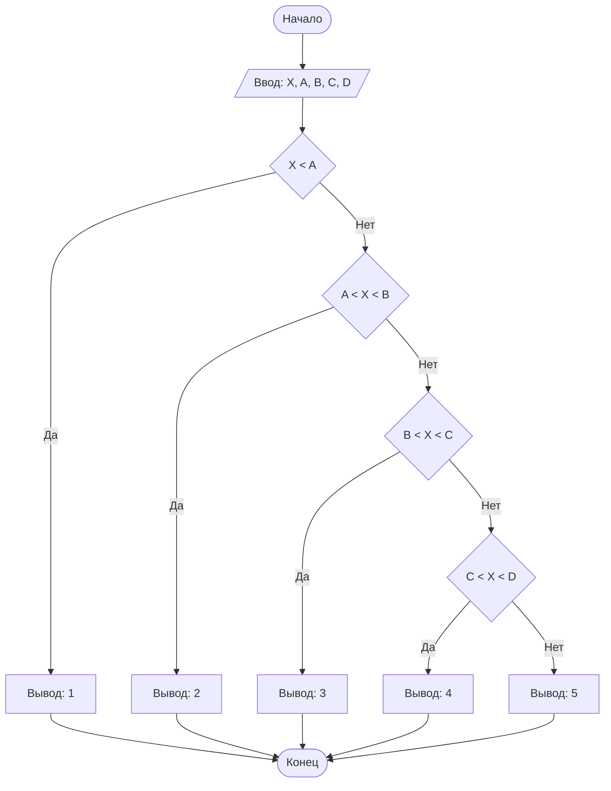

## Отчет по лабораторной работе № 1

#### № группы: `ПМ-2403`

#### Выполнил: `Зайцев Кирилл Владимирович`

#### Вариант: `9`

### Cодержание:

- [Постановка задачи](#1-постановка-задачи)
- [Входные и выходные данные](#2-входные-и-выходные-данные)
- [Выбор структуры данных](#3-выбор-структуры-данных)
- [Алгоритм](#4-алгоритм)
- [Программа](#5-программа)
- [Анализ правильности решения](#6-анализ-правильности-решения)

### 1. Постановка задачи
> На числовой прямой расположены 4 различные точки A, B, C, D
(A<B<C<D), которые разбивают числовую прямую на 5 участков (1, 2, 3, 4, 5
слева направо). В какой из участков попадает точка X? Известно, что X не
равна ни одной из точек A, B, C, D. На вход программы подаются целые числа
X, A, B, C, D.

Рассмотрим данные нам учатски:
- Участок 1: (−∞,A)
- Участок 2: (A,B)
- Участок 3: (B,C)
- Участок 4: (C,D)
- Участок 5: (D+∞)

Мы должны реализовать программу, которая на вход принимает координаты пяти точек X, A, B, C, D, и на основе их значений определяет, в какой из участков находится точка X. Поскольку A, B, C, D разделяют прямую на пять участков, мы сравним X с этими точками и установим принадлежность к одному из них.

Пример:
-	Если A=1, B=3, C=5, D=7, и X=4, то X попадает в участок (B,C), который соответствует участку 3.
-	Если X=0, то X будет в участке (−∞,A), то есть в первом участке.

### 2. Входные и выходные данные
#### Данные на вход
Все числа должны быть различные и удовлетворять условию A<B<C<D
|             | Тип         | min значение    | max значение   |
|-------------|-------------|-----------------|----------------|
| X (Число 1) | Целое число | 10<sup>9</sup>  | 10<sup>9</sup> |
| A (Число 2) | Целое число | -10<sup>9</sup> | 10<sup>9</sup> |
| B (Число 3) | Целое число | -10<sup>9</sup> | 10<sup>9</sup> |
| C (Число 4) | Целое число | -10<sup>9</sup> | 10<sup>9</sup> |
| D (Число 5) | Целое число | -10<sup>9</sup> | 10<sup>9</sup> |

#### Данные на выход
Одно целое число - номер участка в котором расположен X

### 3. Выбор структуры данных
Для решения задачи подойдут простые целочисленные переменные. Будем использовать:
-	Переменные типа int для хранения входных данных X, A, B, C, D.
-	Присвоим участку, в который попадает X, номер от 1 до 5 и выведем этот номер.

### 4. Алгоритм
#### Алгоритм выполнения программы:
1. Ввести пять целых чисел: X, A ,B, C, D.
2. Проверить условия:
- Если X<A, то вывести 1 (участок 1).
-	Если A<X<B, то вывести 2 (участок 2).
-	Если B<X<C, то вывести 3 (участок 3).
-	Если C<X<D, то вывести 4 (участок 4).
-	Если X>D, то вывести 5 (участок 5).
3.  Завершить программу.
 	
#### Блок-схема

### 5. Программа
```java
import java.util.Scanner;

public class Main {
    public static void main(String[] args) {
        // Создаем сканер для считывания входных данных
        Scanner scanner = new Scanner(System.in);

        // Вводим данные
        int X = scanner.nextInt();
        int A = scanner.nextInt();
        int B = scanner.nextInt();
        int C = scanner.nextInt();
        int D = scanner.nextInt();

        // Логика проверки положения точки X
        if (X < A) {
            System.out.println(1); // Участок 1
        } else if (X < B & X > A) {
            System.out.println(2); // Участок 2
        } else if (X < C & X > B) {
            System.out.println(3); // Участок 3
        } else if (X < D & X > C) {
            System.out.println(4); // Участок 4
        } else if (X > D) {
            System.out.println(5); // Участок 5
        } else {
            System.out.println("Введённые числа не соответсвуют условиям задачи, они должны быть различны");
        }

        // Закрываем сканер
        scanner.close();
    }
}


```
### 6. Анализ правильности решения
Программа работает корректно на всем множестве решений с учетом ограничений.
1. Тест на `X = 4, A = 1, B = 3, C = 5, D = 7 `:

    - **Input**:
        ```
        4 1 3 5 7
        ```

    - **Output**:
        ```
        3
        ```

2. Тест на `X = 0, A = 2, B = 4, C = 6, D = 8 `:

    - **Input**:
        ```
        0 2 4 6 8
        ```

    - **Output**:
        ```
        1
        ```
 3. Тест на `X = 9, A = 1, B = 3, C = 5, D = 7 `:

    - **Input**:
        ```
        9 1 3 5 7
        ```

    - **Output**:
        ```
        5
        ```
4. Тест на ограничение задачи `X = 4, A = 1, B = 3, C = 4, D = 7 `:
   
    - **Input**:
        ```
        4 1 3 4 7
        ```

    - **Output**:
        ```
        Введённые числа не соответсвуют условиям задачи, они должны быть различны
        ```
   
